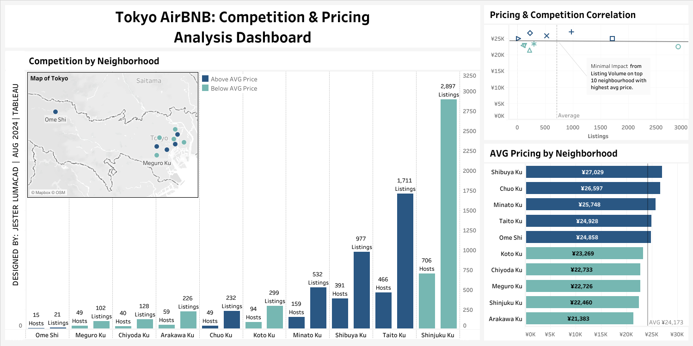
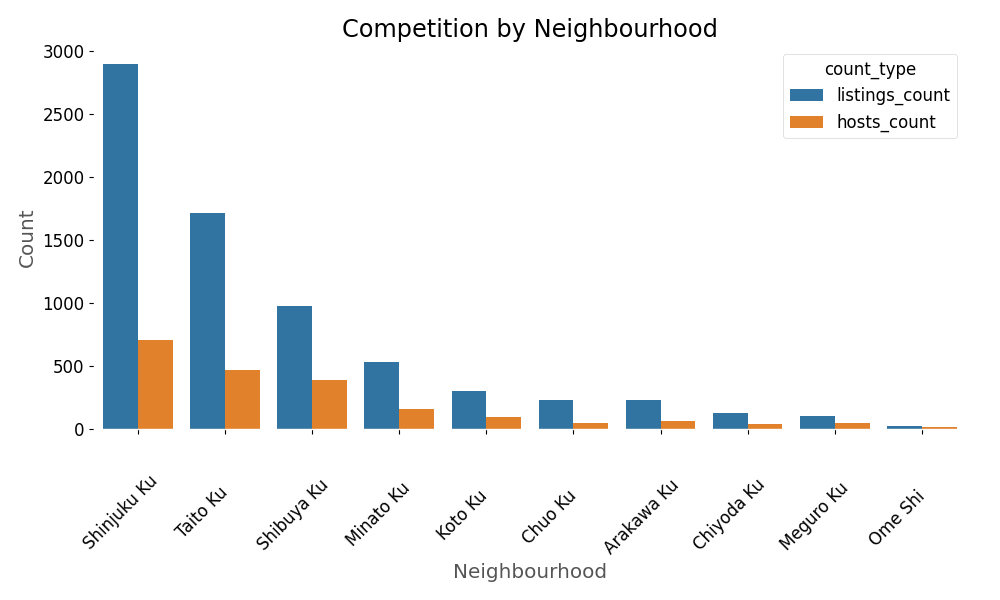
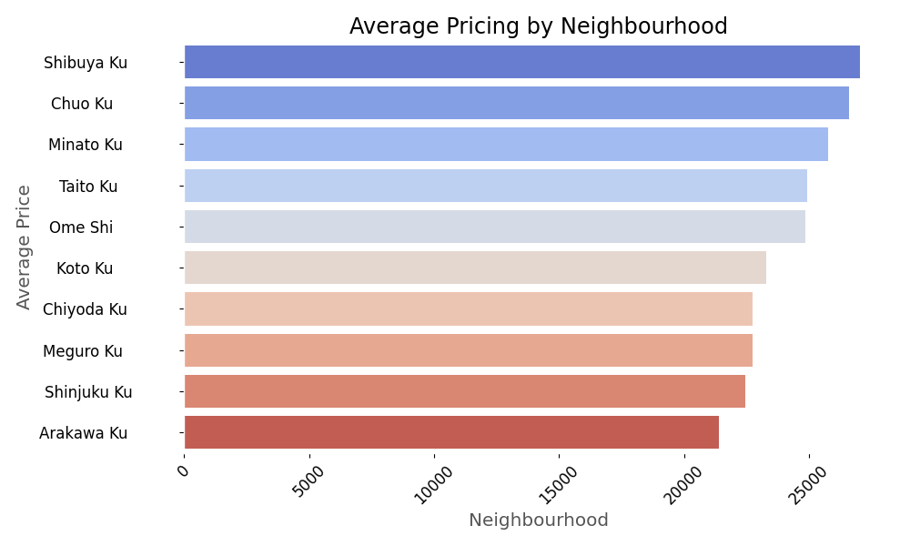
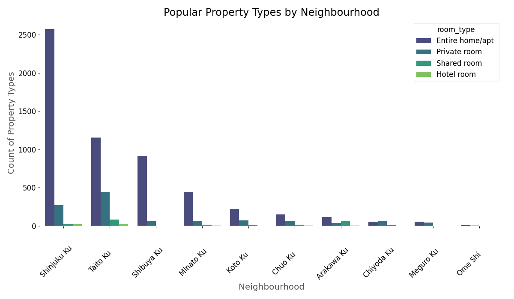

# TOKYO AIRBNB COMPETITION AND PRICING ANALYSIS

## Project Summary 📝 <a name="ProjectSummary"></a>

Welcome to my Tokyo AirBnb **Competition and Pricing Analysis**. This project identifies potential opportunities for starting an Airbnb business in Tokyo, Japan, by leveraging data-driven decision-making and insights. The analysis focuses on pinpointing the most lucrative neighborhoods for new Airbnb ventures, where competition is minimal, and demand is high.

<br />

<div align="center">
    <a href="reports/figures/Tokyo_Airbnb_Competition_and_Pricing.png">
        
    </a>
</div>

### Report outline 🧾 <a name="Reportoutline"></a>

- [Project Summary](#ProjectSummary)
  - [Report outline](#Reportoutline)
  - [Questions to Answer (Business task)](#QuestionstoAnswer)
  - [Tools used](#Toolsused)
  - [Analysis Process](#AnalysisProcess)
- [Step 1 - Gather relevant data](#Gatherrelevantdata)
- [Step 2 - Process data](#Processdata)
- [Step 3 - Explore data](#Exploredata)
  - [Step 3.5 - Visualize data](#Visualizedata)
- [Step 4 - Create a dashboard](#Createdashboard)
- [Step 5 - Insights and Recommendations](#inightsandrecommendations)
  - [Insights](#Insights)
  - [Recommendations](#Recommendations)
  - [Conclusion](#Conclusion)

### Questions to Answer (Business task) ✅ <a name="QuestionstoAnswer"></a>

1. Which are the top 5 and top 10 neighborhoods in Tokyo have the highest average rates for their rooms?

2. Which of these top 10 neighborhoods have the least amount of competition?

3. Which of these top 10 neighborhoods have the most competition in terms of listings?

4. Which room types are most popular in these top 10 neighborhoods?

5. Which neighborhoods would you recommend to be the best for Airbnb startups.

### Tools used (Tech Stack) 🛠 <a name="Toolsused"></a>

1. **VSCode** - For working with Python files, Jupyter Notebooks, and Markdown files.

    - Python, Jupyter Interactive Window, Jupyter Notebook

2. **Python** - For Data Processing, Exploratory Data Analysis and Data Visualization.

    - Pandas, Numpy, Matplotlib, Seaborn

3. **Tableau** - For creating dynamic Dashboards to better present insights.

Other tools:

- **Git** - for version control,

### Analysis Process 🔄 <a name="AnalysisProcess"></a>

- **Step 1** - **Gather relevant data** to create this analysis through publicly available open data sources.
- **Step 2** - **Process data** to ensure that it is ready Exploratory Data Analysis or EDA (Exploratory Data Analysis).
- **Step 3** - **Explore data** to identify patters and trends from the data that answer questions related to the business task.
  - **Step 3.5** - **Visualize data** to gain a visual representation and better understanding of the data story. This is the second half of the EDA process.
- **Step 4** - **Create a dashboard** to combine all the generated data visualizations and insights from the EDA process.
- **Step 5** - Present **insights and recommendations** by exporting figures and charts created during EDA to create a comprehensive report and documentation and by creating a dynamic Tableau dashboard.

## Step 1 - Gather relevant data 🧐 <a name="Gatherrelevantdata"></a>

The [raw data](data/raw/listings.csv) was taken from [Inside AirBnb](https://insideairbnb.com/get-the-data/), an official AirBnb open data source that has AirBnb data from dozens of cities and countries around the world.

From all of the cities and countries listed, I navigated to Tokyo, Japan and extracted the listings.csv file since it is the best option for this analysis.

## Step 2 - Process data 🔃 <a name="Processdata"></a>

In this step of the process, the [clean data](/data/clean/cleaned_listings.csv) is created. This is the data that will be used for data exploration, visualization and analysis.

The clean data is created using the [dataset-v1.0.py](scripts/data/dataset-v1.0.py) script shown below.

>🔎Info: I also converted the script into the jupyter notebook [jl-data-cleaning-v1.0.ipynb](notebooks/jl-data-cleaning-v1.0.ipynb). Click the link if you prefer viewing in a jupyter notebook format.

<details>

<summary>👀 see code for data processing </summary>

```python
# Import necessary libraries
import os
import numpy as np
import pandas as pd

# Read file from root .\data\raw\
script_dir = os.path.dirname(__file__)
listings_file_path = os.path.join(script_dir, "../../data/raw/listings.csv")

# Read the CSV file into a DataFrame
df_listings = pd.read_csv(listings_file_path)
```

Read data from the [raw data folder](data/raw/) and as a Pandas DataFrame.

```python
# Cleaning df_listings
listings_clean = (
    df_listings.copy()
)  # Creating copy of the df_listings before making changes

# Cleaning column names since they contain white spaces
listings_clean.columns = listings_clean.columns.str.strip().str.lower()
listings_clean = (
    listings_clean.drop(
        columns=[
            "neighbourhood_group",
            "minimum_nights",
            "number_of_reviews",
            "last_review",
            "reviews_per_month",
            "calculated_host_listings_count",
            "availability_365",
            "number_of_reviews_ltm",
            "license",
        ]
    ).drop_duplicates()  # Dropping duplicate data
)

# Quick check to see if changes were made
listings_clean.head()
listings_clean.info()

# Replacing non-ASCII characters with blank spaces.
listings_clean["name"] = listings_clean["name"].apply(
    lambda x: "" if any(ord(char) > 127 for char in x) else x
)
listings_clean["host_name"] = listings_clean["host_name"].apply(
    lambda x: "" if any(ord(char) > 127 for char in x) else x
)

# Replace empty strings in the 'price' column with NaN.
listings_clean["price"] = pd.to_numeric(
    listings_clean["price"].replace("", np.nan), errors="coerce"
)

# Drop rows with NaN values in 'price'
listings_clean = listings_clean.dropna(subset=["price"])

# Convert to int64 (this removes decimal places)
listings_clean["price"] = listings_clean["price"].astype(int)

# Create a copy of the cleaned listings DataFrame
df_listings_cleaned = listings_clean.copy()

print(df_listings_cleaned.head)
```

Code for data cleaning as seen in the [dataset-v1.0.py](scripts/data/dataset-v1.0.py) script.

```python
# Creating directory path for export of cleaned data.
clean_data_dir = os.path.join("..", "..", "data", "clean")
cleaned_listings_export_path = os.path.abspath(
    os.path.join(script_dir, clean_data_dir, "cleaned_listings.csv")
)

# Exporting cleaned data to directory.
df_listings_cleaned.to_csv(cleaned_listings_export_path, index=False)
print("Data Cleaning Completed!")
```

exporting data to [processed data folder](data/processed/).

</details>

## Step 3 - Explore data 🧭 <a name="Exploredata"></a>

In this step of the process, the [clean data](data/clean/cleaned_listings.csv) is explored to get an overview of the data and to identify patterns and trends that we can derive insights from.

Data exploration on the [cleaned data](data/clean/cleaned_listings.csv) is done using the [eda-v1.0.py](scripts/data/eda-v1.0.py) script shown below.

>🔎Info: I conducted the data exploration using the `Jupyter Interactive Window` feature in VSCode. Thus, all of the output from this script is generated in the jupyter notebook [jl-data-exploration-v1.0.ipynb](notebooks/jl-data-exploration-v1.0.ipynb). Click the link to view the jupyter notebook with all the EDA outputs.

<details>

<summary>👀 see code for data exploration </summary>

```python
# Import necessary libraries
import os
import numpy as np
import pandas as pd

# Load the dataset
script_dir = os.path.dirname(__file__)
data_path = os.path.join(script_dir, "../../data/clean/cleaned_listings.csv")
df = pd.read_csv(data_path)

df.head()  # Inspect the first few rows
df.info()  # Get basic info about the dataset
df.isnull().sum()  # Check for missing values
df.describe()  # Summary statistics for numerical columns
df.median(numeric_only=True)  # Calculate Median for numerical columns
df.mode(numeric_only=True).iloc[0]  # Calculate Mode for numerical columns
df.nunique()  # Unique values count for categorical columns

# Distribution of Listings Across Neighborhoods
df["neighbourhood"].value_counts()

# Correlation Analysis
# Select only the numerical columns for the correlation matrix
numerical_df = df.select_dtypes(include=[np.number])
correlation_matrix = numerical_df.corr()  # Create the correlation matrix
price_correlations = correlation_matrix["price"].sort_values(
    ascending=False
)  # Focus on correlation with 'price'
print("Price Correlations:\n", price_correlations)

# Distribution and Analysis of Key Metrics
# Listings count by Host
listings_per_host = (
    df.groupby("host_id")
    .size()
    .sort_values(ascending=False)
    .reset_index(name="listings_count")
)
print("Listings per Host:\n", listings_per_host)

# Summary statistics for neighborhoods
neighbourhood_stats = (
    df.groupby("neighbourhood")["price"]
    .agg(["count", "mean", "median", "std"])
    .sort_values("count", ascending=False)
    .reset_index()
)
print("Neighbourhood Stats:\n", neighbourhood_stats)
print("\nEND OF EXPLORATORY DATA ANALYSIS!")
```

</details>

### Step 3.5 - Visualize data 📈 <a name="Visualizedata"></a>

In this step, I supported my exploratory data analysis with quick data visualization using matplotlib and seaborn to plot the data giving me a better visual understand of the data story.

>🔎Info: I conducted the data visualization using the `Jupyter Interactive Window` feature in VSCode. Thus, all of the output from this script is generated in the jupyter notebook [jl-data-exploration-v1.0.ipynb](notebooks/jl-data-viz-v1.0.ipynb). Click the link to view the jupyter notebook with all the EDA outputs.

<details>

<summary>👀 see code for data visualization </summary>

```python
import os

import matplotlib.pyplot as plt
import pandas as pd
import seaborn as sns
import utility.plots_cfg  # noqa: F401

# Load the dataset
script_dir = os.path.dirname(__file__)
data_path = os.path.join(script_dir, "../data/clean/cleaned_listings.csv")
df = pd.read_csv(data_path)

# *1. Competition by Neighbourhood (Side-by-side chart)
# Calculate average price per neighbourhood
avg_price_per_neighbourhood = df.groupby("neighbourhood")["price"].mean().reset_index()
avg_price_per_neighbourhood = avg_price_per_neighbourhood.sort_values(
    by="price", ascending=False
)

# Select the 2nd to 11th average price per neighbourhood
top_neighbourhoods = avg_price_per_neighbourhood.sort_values(
    by="price", ascending=False
).iloc[1:11]

# Filter the original dataframe for these neighbourhoods
filtered_df = df[df["neighbourhood"].isin(top_neighbourhoods["neighbourhood"])]

# Count of "id" (listings) per neighbourhood
listings_count = (
    filtered_df.groupby("neighbourhood")["id"]
    .count()
    .reset_index(name="listings_count")
)

# Count of "host_id" per neighbourhood
hosts_count = (
    filtered_df.groupby("neighbourhood")["host_id"]
    .nunique()
    .reset_index(name="hosts_count")
)

# Merge the counts into one dataframe for plotting
merged_counts = pd.merge(listings_count, hosts_count, on="neighbourhood").sort_values(
    by="listings_count", ascending=False
)

# Melt the dataframe to prepare for a side-by-side barplot
melted_counts = merged_counts.melt(
    id_vars="neighbourhood",
    value_vars=["listings_count", "hosts_count"],
    var_name="count_type",
    value_name="count",
)
# Plot the data
fig1, ax = plt.subplots(figsize=(10, 6))
sns.barplot(x="neighbourhood", y="count", hue="count_type", data=melted_counts, ax=ax)
ax.set_title("Competition by Neighbourhood")
ax.set_xlabel("Neighbourhood")
ax.set_ylabel("Count")
plt.xticks(rotation=45)
plt.tight_layout()

plt.show()


# *2. Pricing & Competition Correlation (Scatter plot)
# Calculate the count of "id" and average price per "neighbourhood"
filtered_df2 = (
    filtered_df.groupby("neighbourhood")
    .agg(id_count=("id", "count"), average_price=("price", "mean"))
    .sort_values(by="average_price", ascending=True)
    .reset_index()
)

# Plot the data
fig2, ax = plt.subplots(figsize=(8, 5))
sns.regplot(x="id_count", y="average_price", data=filtered_df2, ci=None, ax=ax)
ax.set_title("Pricing & Competition Correlation")
ax.set_xlabel("Number of Listings")
ax.set_ylabel("Average Price")
ax.set_ylim(0, None)
plt.tight_layout()

plt.show()


# *3. AVG Pricing by Neighbourhood (Bar chart)
fig3, ax = plt.subplots(figsize=(10, 6))
sns.barplot(
    x="average_price",
    y="neighbourhood",
    data=filtered_df2.sort_values(by="average_price", ascending=False),
    palette="coolwarm",
    ax=ax,
    orient="h",
)
ax.set_title("Average Pricing by Neighbourhood")
ax.set_xlabel("Neighbourhood")
ax.set_ylabel("Average Price")
plt.xticks(rotation=45)
plt.tight_layout()

plt.show()


# *4. Popular Property Types by Neighbourhood (Bar chart)
# Calculate the count of room types per neighbourhood
room_counts = (
    filtered_df.groupby(["neighbourhood", "room_type"]).size().reset_index(name="count")
)

# Determine the total count per neighbourhood
neighbourhood_order = (
    room_counts.groupby("neighbourhood")["count"]
    .sum()
    .sort_values(ascending=False)
    .index
)

# Plot the bar chart
fig4, ax = plt.subplots(figsize=(12, 7))
sns.countplot(
    x="neighbourhood",
    hue="room_type",
    data=filtered_df,
    palette="viridis",
    ax=ax,
    order=neighbourhood_order,  # Apply the sorted order
)
ax.set_title("Popular Property Types by Neighbourhood")
ax.set_xlabel("Neighbourhood")
ax.set_ylabel("Count of Property Types")
plt.xticks(rotation=45)
plt.tight_layout()

plt.show()


# *5. Host Analysis Based on Listing Volume (Histogram)
filtered_df["listings_per_host"] = filtered_df.groupby("host_id")["id"].transform(
    "count"
)
fig5, ax = plt.subplots(figsize=(10, 6))
sns.histplot(filtered_df["listings_per_host"], bins=30, kde=True, color="Blue", ax=ax)
ax.set_title("Host Analysis: Listings per Host")
ax.set_xlabel("Number of Listings per Host")
ax.set_ylabel("Frequency")
plt.tight_layout()

plt.show()


# *6. Correlation Analysis Visualization
numerical_df = filtered_df.select_dtypes(include=[float, int])
correlation_matrix = numerical_df.corr()

# Correlation Heatmap
fig6, ax = plt.subplots(figsize=(12, 8))
sns.heatmap(correlation_matrix, annot=True, cmap="coolwarm", fmt=".2f", ax=ax)
ax.set_title("Correlation Heatmap of Numerical Features")

plt.show()


# *7.Correlation with 'price'
price_correlations = correlation_matrix["price"].sort_values(ascending=False)
fig7, ax = plt.subplots(figsize=(10, 6))
price_correlations.drop("price").plot(kind="bar", color="skyblue", ax=ax)
ax.set_title("Correlation of Features with Price")
ax.set_xlabel("Features")
ax.set_ylabel("Correlation Coefficient")
plt.xticks(rotation=45)
plt.tight_layout()

plt.show()


from utility.save_plots import export_figs  # noqa: E402 (disable not ot top of file warning)


export_dir = os.path.join(script_dir, "../reports/figures/")
figures = [
    (fig1, "competition_by_neighbourhood.png"),
    (fig2, "pricing_and_competition_correlation.png"),
    (fig3, "average_pricing_by_neighbourhood.png"),
    (fig4, "popular_property_types_by_neighbourhood.png"),
    (fig5, "listings_per_host_histogram.png"),
    (fig6, "correlation_heatmap.png"),
    (fig7, "correlation_with_price.png"),
]

for index, (fig, filename) in enumerate(figures, start=1):
    export_figs(export_dir, fig, index, filename)

print("Figures exported to ../reports/figures/")

```

</details>

<br />

**Charts generated using Matplotlib and Seaborn**

Figure 1 - Competition by Neighbourhood <a name="fig1"></a>

<div align="center">
    <a href="reports/figures/fig_001_competition_by_neighbourhood.png">
        
    </a>
</div>

<details>

<summary><b>👀 see insights</b></summary>

- **Least Competitive Neighborhoods: (Top 5)**
  - **Chuo Ku** so far leads in all categories being the second to the highest in terms of average price (¥26,597) but having relatively low competition with only 49 competitor host and 232 listings.
  - Other less competitive neighborhoods include **Ome Shi** and **Meguro Ku**, with minimal listings (21 and 49, respectively) and hosts (15 and 49), presenting further opportunities for market penetration with less competitive pressure.

- **Least Competitive Neighborhoods:**
  - **Ome Shi** and **Meguro Ku** have the fewest listings (21 and 49, respectively) with only 15 and 49 hosts, making them potentially lucrative areas for new entrants.
  - These neighborhoods have fewer competitors while still maintaining relatively high average prices, suggesting potential for growth with less risk.

- **Most Competitive Neighborhoods:**
  - **Shinjuku Ku** and **Taito Ku** lead in competition with the highest number of listings (2,897 and 1,711, respectively).
  - **Shibuya Ku** has fewer listings (977) but maintains a high average rate, suggesting it is a sought-after location with strong demand.

</details>

<br />

Figure 2 - Pricing and Competition Correlation <a name="fig2"></a>

<div align="center">
    <a href="reports/figures/fig_001_competition_by_neighbourhood.png">
        
    </a>
</div>

<details>

<summary><b>👀 see insights</b></summary>

- **Prince and Competition Correlation:**
  - A relatively **flat trend line** in this correlation chart indicates that there is **little to no correlation** between average prices per neighbourhood and the number of listings per neighbourhood across the top 10 neighbourhoods.
  - This means **higher competition does not mean lower prices** and **higher prices does not mean lower competition**.

</details>

<br />

Figure 3 - Average Pricing by Neighbourhood <a name="fig3"></a>

<div align="center">
    <a href="reports/figures/fig_001_competition_by_neighbourhood.png">
        
    </a>
</div>

<details>

<summary><b>👀 see insights</b></summary>

- **Highest Average Room Rates:**
  - **Top 5 neighborhoods** with the highest average room rates are **Shibuya Ku (¥27,029)**, **Chuo Ku (¥26,597)**, **Minato Ku (¥25,748)**, **Taito Ku (¥24,928)**, and **Ome Shi (¥24,858)**.
  - These neighborhoods have the highest overall average rate across the top 10 neighborhoods which is is ¥24,173, indicating a healthy market for premium-priced listings.

</details>

<br />

Figure 4 - Popular Property Types by Neighbourhood <a name="fig4"></a>

<div align="center">
    <a href="reports/figures/fig_001_competition_by_neighbourhood.png">
        
    </a>
</div>

<details>

<summary><b>👀 see insights</b></summary>

- **Room Types Popularity:**
  - **Entire home/apartment** room types are the most popular across neighborhoods followed by **Private room**. The gap between **Entire home/apartment** and **Private room** room types is relatively large specially in the neighborhoods where the number of listings are high.
  - Higher average prices in these neighborhoods coupled with data that shows higher listings **Entire home/apartment** and **Private room** indicates a strong demand for more premium room types.

</details>

<br />

Other figures can be found in the [reports/figures](/reports/figures) folder.

## Step 4 - Create a dashboard 📊 <a name="Createdashboard"></a>

Utilized **Tableau** to combine all the generated data visualizations and insights from the exploratory data analysis into one dashboard for a more birds-eye-view of the data.

[View Dashboard in Tableau Public](https://public.tableau.com/views/Book3_17249856024470/Dashboard2?:language=en-US&:sid=&:redirect=auth&:display_count=n&:origin=viz_share_link) to experience the dynamic dashboard for yourself.

>💡Tip: Once you are in the Tableau Public dashboard, try clicking on the bards in the chart and zooming into the map to see data for specific neighborhoods.

[](https://public.tableau.com/views/Book3_17249856024470/Dashboard2?:language=en-US&:sid=&:redirect=auth&:display_count=n&:origin=viz_share_link)

## Step 5 - Insights and Recommendations 🧠 <a name="inightsandrecommendations"></a>

### Insights ❕ <a name="Insights"></a>

<br />

- **Highest Average Room Rates:** *see [Figure 3](#fig3)*
  - **Top 5 neighborhoods** with the highest average room rates are **Shibuya Ku (¥27,029)**, **Chuo Ku (¥26,597)**, **Minato Ku (¥25,748)**, **Taito Ku (¥24,928)**, and **Ome Shi (¥24,858)**.
  - These neighborhoods have the highest overall average rate across the top 10 neighborhoods which is is ¥24,173, indicating a healthy market for premium-priced listings.

<br />

- **Least Competitive Neighborhoods: (Top 5)** *see [Figure 1](#fig1)*
  - **Chuo Ku** so far leads in all categories being the second to the highest in terms of average price (¥26,597) but having relatively low competition with only 49 competitor host and 232 listings.
  - Other less competitive neighborhoods include **Ome Shi** and **Meguro Ku**, with minimal listings (21 and 49, respectively) and hosts (15 and 49), presenting further opportunities for market penetration with less competitive pressure.
  
<br />

- **Least Competitive Neighborhoods:** *see [Figure 1](#fig1)*
  - **Ome Shi** and **Meguro Ku** have the fewest listings (21 and 49, respectively) with only 15 and 49 hosts, making them potentially lucrative areas for new entrants.
  - These neighborhoods have fewer competitors while still maintaining relatively high average prices, suggesting potential for growth with less risk.

<br />

- **Most Competitive Neighborhoods:** *see [Figure 1](#fig1)*
  - **Shinjuku Ku** and **Taito Ku** lead in competition with the highest number of listings (2,897 and 1,711, respectively).
  - **Shibuya Ku** has fewer listings (977) but maintains a high average rate, suggesting it is a sought-after location with strong demand.

<br />

- **Prince and Competition Correlation:** *see [Figure 2](#fig2)*
  - A relatively **flat trend line** in this correlation chart indicates that there is **little to no correlation** between average prices per neighbourhood and the number of listings per neighbourhood across the top 10 neighbourhoods.
  - This means **higher competition does not mean lower prices** and **higher prices does not mean lower competition**.

<br />

- **Room Types Popularity:** *see [Figure 4](#fig4)*
  - **Entire home/apartment** room types are the most popular across neighborhoods followed by **Private room**. The gap between **Entire home/apartment** and **Private room** room types is relatively large specially in the neighborhoods where the number of listings are high.
  -Higher average prices in these neighborhoods coupled with data that shows higher listings **Entire home/apartment** and **Private room** indicates a strong demand for more premium room types.

<br />

### Recommendations ❕ <a name="Recommendations"></a>

- **Capitalize on Chuo Ku's High Price and Low Competition:** Focus on entering the market in **Chuo Ku**, where the potential for high earnings meets relatively low competition. Developing properties with unique offerings or upscale amenities could attract premium guests and maximize profits.

<br />

- **Capitalize on High-Rate Neighborhoods:** Maintain a presence in premium areas like **Shibuya Ku** and **Minato Ku**. Consider investing in unique or high-end properties that cater to international tourists and business travelers, given their willingness to pay above-average rates.

<br />

- **Differentiate in Competitive Markets:** In more saturated areas like **Taito Ku**, **Shibuya Ku**, and **Minato Ku**, stand out by offering specialized stays (e.g., themed properties or local partnerships) that cater to niche markets or unique guest experiences.
<br />

- **Expand in Low-Competition Areas:** Target other less competitive neighborhoods like **Ome Shi** for new listings, leveraging the neighborhood's untapped potential while maintaining competitive pricing.

<br />

- **Explore Room Type Demand:** Further analysis is needed to understand room type preferences in these neighborhoods. Focus on offering a mix of room types (e.g., entire homes, private rooms) tailored to the target audience's needs in the selected neighborhoods.

### Conclusion ❕ <a name="Conclusion"></a>

By strategically entering low-competition, high-potential neighborhoods such as **Chuo Ku** and effectively differentiating offerings in more competitive areas, Airbnb hosts can optimize profitability and gain a stronger foothold in Tokyo's dynamic market. Further understanding of room type demand will refine these strategies, ensuring a successful and sustainable Airbnb business.
